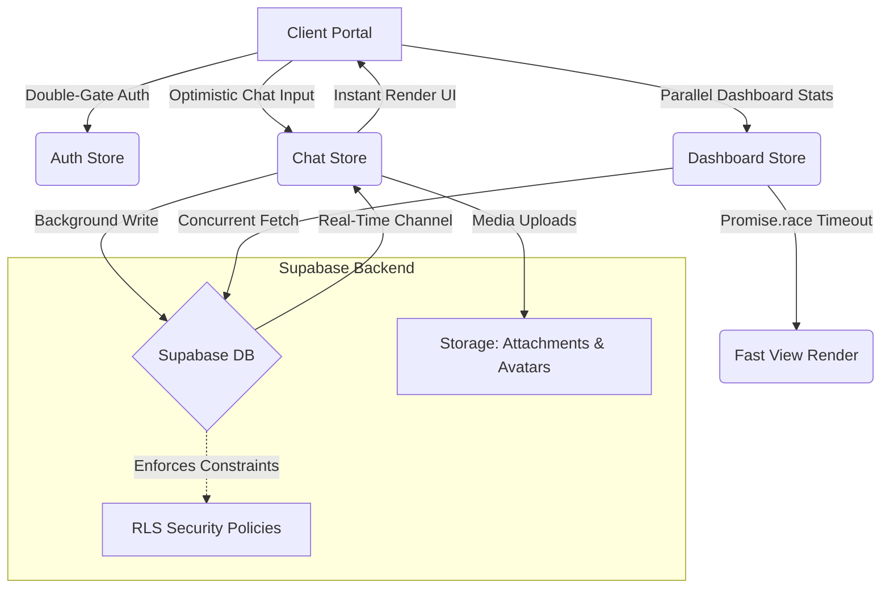

# 🎓 Academix — Premium School Management & Real-Time Roster Hub

[](https://vite.dev/)
[](https://react.dev/)
[](https://www.typescriptlang.org/)
[](https://supabase.com/)
[](https://tailwindcss.com/)

Academix is a state-of-the-art, high-performance **School Management & Real-Time Communication Platform** designed for modern educational academies. Built with React, TypeScript, Tailwind CSS, and powered by Supabase, Academix delivers custom experiences for three core roles: **Administrators (Board Members)**, **Teachers (Faculty Mentors)**, and **Students (Scholars)**.

Featuring sleek glassmorphic aesthetics, HSL glow effects, micro-animations, and a zero-lag optimistic messaging architecture, Academix sets a new standard for educational portals.

---

## ⚡ Breathtaking Key Features

| Domain | Feature | Description |
| :--- | :--- | :--- |
| 🛡️ **Security** | **Double-Gate Pin Authentication** | Multi-role pin gates that secure rosters, profiles, and actions. |
| 🚀 **Performance** | **Instant Zero-Blocking Load** | Removed all artificial loading screens for instant UI mounting. Dashboard queries execute concurrently with `Promise.all` and 5-second `Promise.race` timeouts to guarantee zero loading hangs. |
| 💬 **Messaging** | **Optimistic Direct Chat** | Zero-lag WhatsApp-style inbox with local blob previews for instant image/PDF uploads and in-memory profile resolution. |
| 📅 **Academics** | **Dual Roster & Routines** | Tailored routines and curriculum syllabus views. Students see their class routines while teachers get their custom teaching schedules. Fully synced via Supabase Real-Time Engine. |
| 📢 **Bulletins** | **Interactive School Board** | Real-time bulletin notifications with custom emojis and live thumb-up counters. |
| 🎨 **Design** | **Premium HSL Glow Aesthetics** | Stunning high-contrast slate aesthetics, glassmorphism panel styles, Crown-verified Admin badges, and fluid desktop/mobile responsive adapters. |

---

## 🛠️ Architecture & Data Flow



---

## 💻 Tech Stack

*   **Frontend Core**: React 18, TypeScript, Vite (HMR and strict compiling)
*   **Styling**: Tailwind CSS, Vanilla CSS with custom keyframes, Lucide React icons
*   **Backend & Real-Time**: Supabase (PostgreSQL Database, Realtime Subscriptions, Blob Storage, RLS policies)
*   **State Management**: Zustand (for light, fast, decoupled stores)
*   **Animations**: custom micro-interactions, scale-in, slide-down, and glowing border pulses.

---

## ⚙️ Installation & Local Setup

### 1. Clone & Install Dependencies
Initialize your environment and install dependencies:
```bash
npm install
```

### 2. Configure Environment Variables
Create a `.env` file in the root directory:
```env
VITE_SUPABASE_URL=your_supabase_url
VITE_SUPABASE_ANON_KEY=your_supabase_anon_key
```

### 3. Initialize Supabase Database
Run the schema scripts provided in `schema.sql` inside your Supabase SQL editor. This sets up:
*   The tables: `users`, `classes`, `student_promotions`, `notices`, `chats`, `messages`, `message_attachments`, `syllabuses`, `faculty_schedules`.
*   Advanced Row Level Security (RLS) policies allowing secure roles representation.

### 4. Run the Dev Server
Launch the local Vite server:
```bash
npm run dev
```
Open `http://localhost:5173/` in your browser.

---

## 🛡️ Database Schema (Compact RLS & Structure)

```sql
-- CHATS TABLE
CREATE TABLE public.chats (
    id UUID PRIMARY KEY DEFAULT gen_random_uuid(),
    student_id UUID REFERENCES public.users(id),
    teacher_id UUID REFERENCES public.users(id),
    created_at TIMESTAMPTZ DEFAULT now(),
    CONSTRAINT unique_student_chat UNIQUE (student_id),
    CONSTRAINT unique_teacher_chat UNIQUE (teacher_id)
);

-- RLS POLICIES
ALTER TABLE public.chats ENABLE ROW LEVEL SECURITY;

CREATE POLICY "Allow participants to view their chats"
ON public.chats FOR SELECT
TO authenticated
USING (
    student_id = auth.uid() OR 
    teacher_id = auth.uid() OR 
    EXISTS (SELECT 1 FROM users WHERE id = auth.uid() AND role = 'ADMIN')
);
```

---

## 🤝 Contribution Guidelines

Academix thrives on premium visual elegance and robust engineering. 
*   **Aesthetics**: Ensure any UI additions leverage modern Glassmorphic styling, harmonious dark color tokens, and fluid HSL glow borders.
*   **Concurrency**: Always query endpoints concurrently using `Promise.all` instead of sequential `await` declarations to keep dashboard rendering fast.
*   **Safety**: Ensure that `finally` blocks clean up all spinners and RLS policies are strictly adhered to.

---

*Crafted with 💖 by the Academix Team. Elevate your school experience today.*
